

  

<h1 align="center">Super arXiv</h1>

  <a href="README.md">中文</a> | <b>English</b>

  An efficiency plugin for <code>arxiv.org</code> that helps you search, filter, download, and manage papers faster.

  
  
  
  
  

  
  

  Edge version is under review, stay tuned.

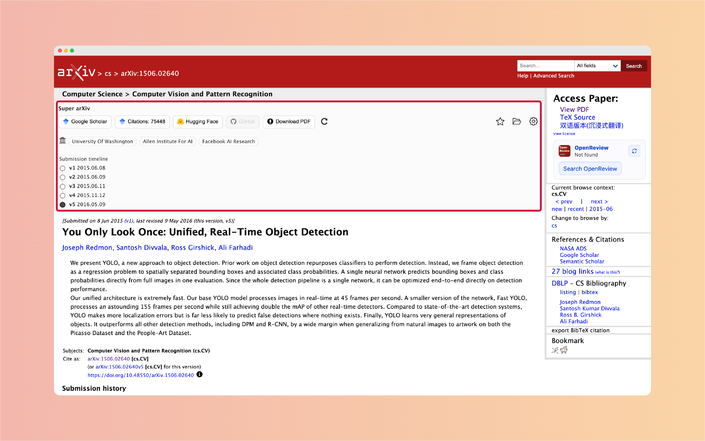

## ✨ Why Choose Super arXiv?

- 📌 Directly display an enhanced toolbar on the arXiv abstract page, reducing the cost of switching back and forth between pages.
- 🔎 One-click jump to `Google Scholar`, `Hugging Face Papers`, and `GitHub` to quickly complete the paper context.
- 🕒 Display the submission version timeline to help you quickly understand the paper iteration history.
- 📚 Built-in bookmarks, subfolders, batch downloads, and note-taking capabilities for easy continuous organization of literature.
- 💾 Automatically organize filenames when downloading PDFs, making it more suitable for local archiving.
- 🔐 Bookmarks and settings are saved locally in the browser, ready to use out of the box.

## 🚀 Quick Start

1. Go to [Chrome Web Store to install Super arXiv](https://chromewebstore.google.com/detail/super-arxiv/emjofeihemfkkooiabkgnfocghkmeabk)
2. Open any arXiv abstract page, e.g., `https://arxiv.org/abs/2401.01234`
3. Use the `Super arXiv` toolbar in the page title area
4. For first-time use, it is recommended to open `Settings` first and adjust the display components according to your habits

## 🧩 Core Capabilities

### Paper Page Enhancement

- `Google Scholar`: Quickly view related work and citations
- `Citations`: Display citation counts, need to be manually enabled in the settings page
- `Hugging Face Papers`: If the paper has been indexed, you can jump with one click
- `GitHub`: Automatically aggregate links to code related to the paper
- `Download PDF`: One-click download and automatic filename organization
- `Submission timeline`: View paper version change history
- `Affiliations`: Identify author affiliation information
- `Refresh`: Manually refresh extended information such as citation counts and affiliations

### Bookmarks and Management

- Bookmark/Unbookmark the current paper
- Create, rename, delete, and move folders and subfolders
- Batch download PDFs (ZIP)
- Batch remove bookmarks
- Record personal notes
- Export to Excel for easy organization, review, and sharing

## 🖼️ Feature Preview

### 🔎 Google Scholar

Open the search results page for the current paper in Scholar, making it easy to quickly view related work and citations.

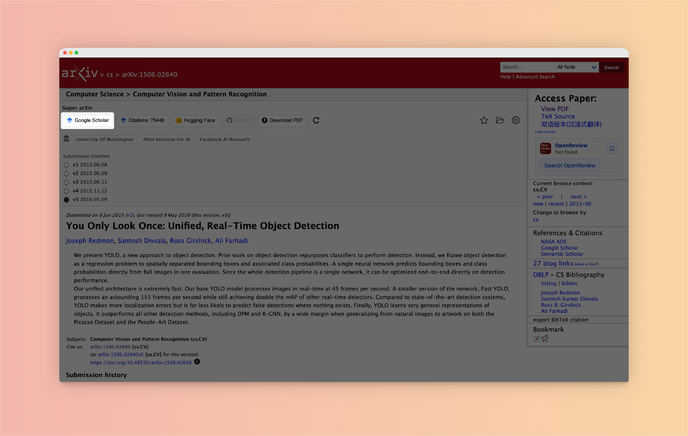

### 📈 Citations (Optional)

Display citation count information. For first-time use, go to the settings page to enable it. If `-` or no display appears, it is usually related to the network environment or upstream restrictions; you can try again later.

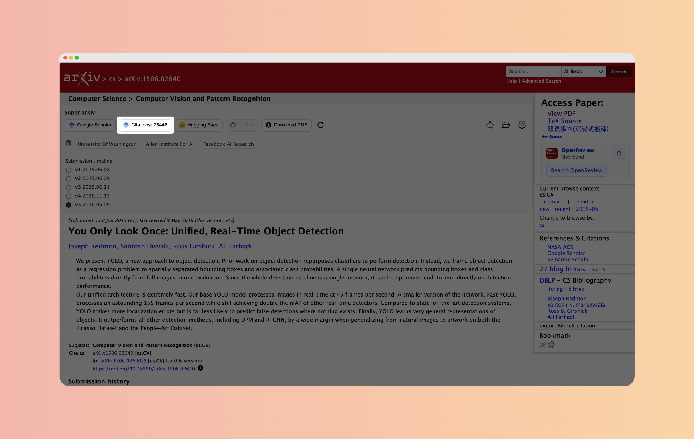

### 🤗 Hugging Face

Jump to the corresponding Hugging Face Papers page; if the paper has not yet been indexed, no valid jump result will be displayed.

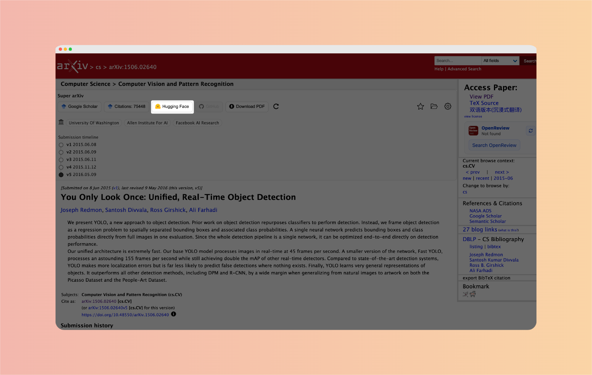

### 🧑‍💻 GitHub

Automatically aggregate links to code related to the paper; if no available repository is found, the button will remain unclickable.

### ⬇️ Download PDF

Download the current paper PDF and automatically organize it into a more manageable filename (usually the paper title).

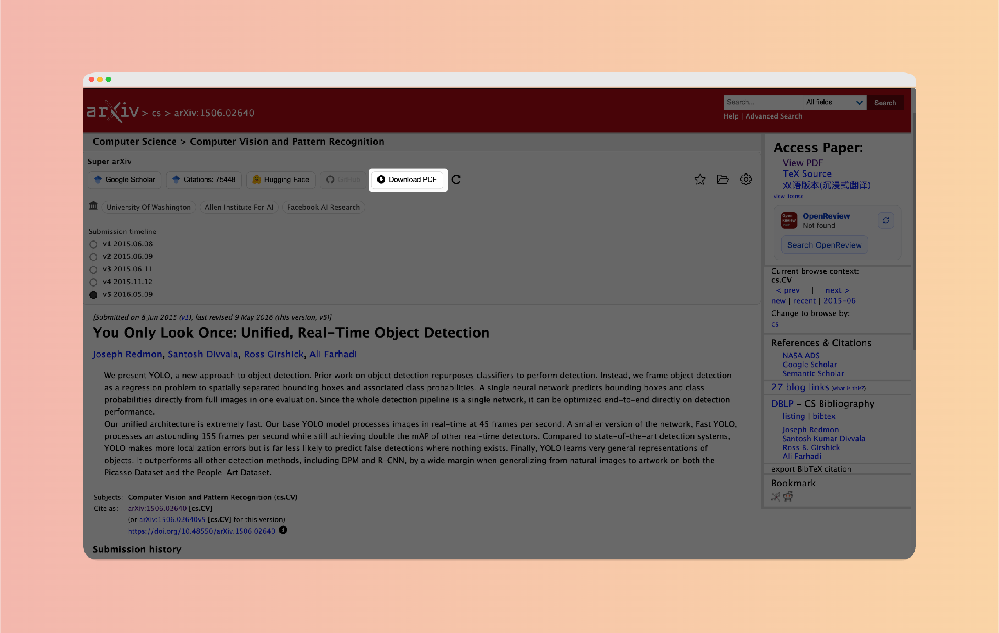

### 🕒 Submission timeline

Display the paper submission version timeline to help you quickly understand the version change history.

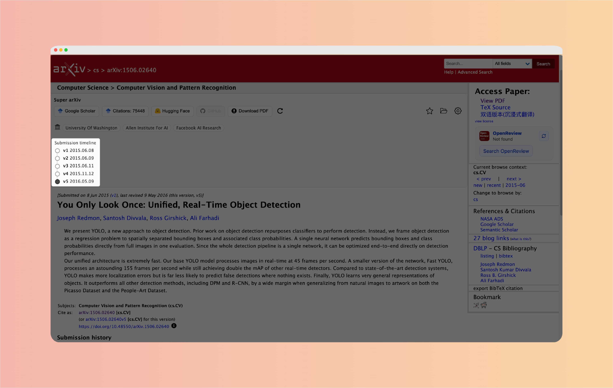

### 🏫 Affiliations

Display author affiliation information to help quickly judge research background and institutional sources.

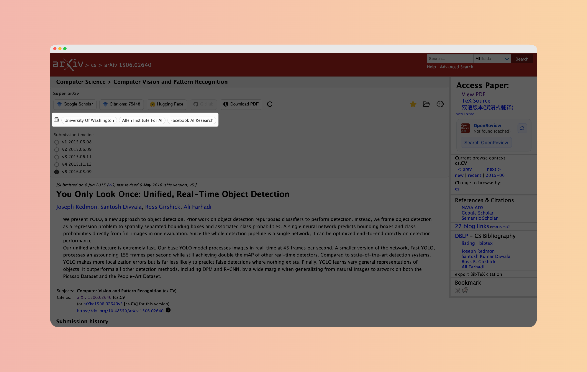

## 📚 Bookmarks

The bookmark system supports a complete management process from "recording" to "exporting," suitable for long-term accumulation and systematic organization of literature.

### 🗂️ Subfolder Management

Support creating, renaming, deleting, and moving subfolders, making it easy to organize bookmarks by topic, project, or research direction.

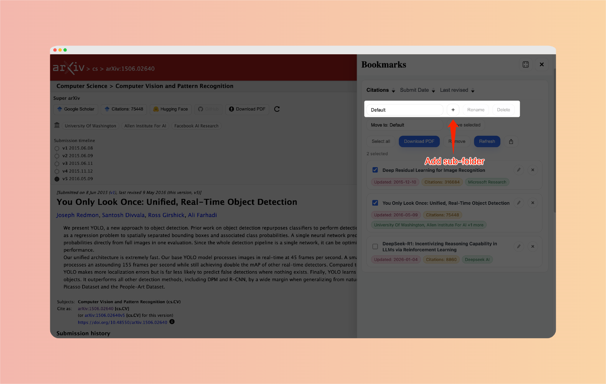

### 📦 Batch Operations

Support batch download, batch removal, and other operations, significantly improving organization efficiency.

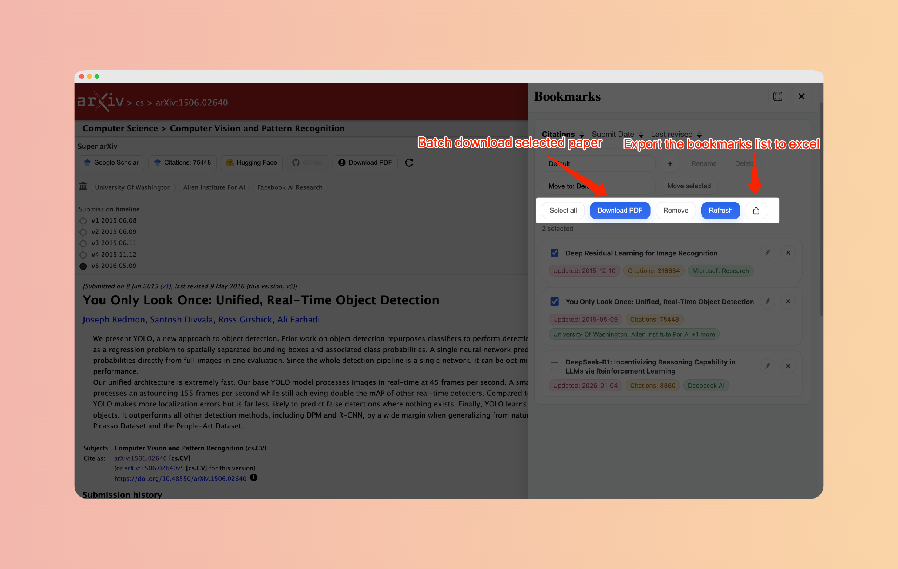

### 📝 Note-taking

Personal notes can be added to papers for later review, reflection, and secondary screening.

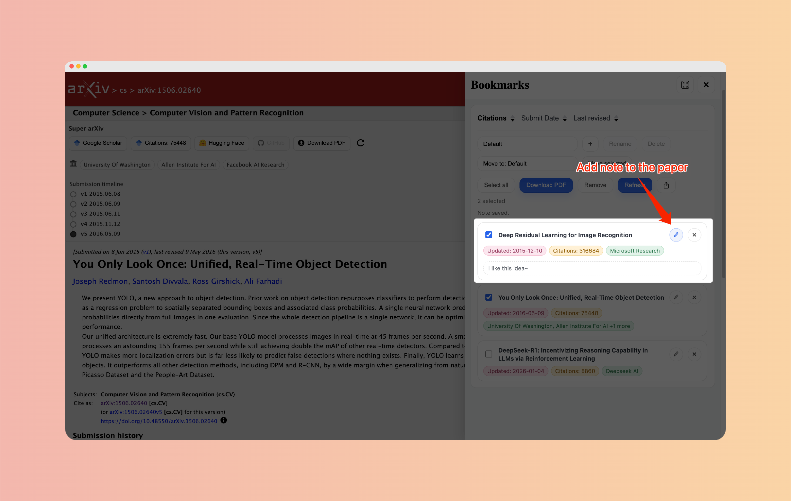

## ⚙️ Settings

In `Settings`, you can:

- Control whether each feature in the toolbar is displayed
- Enable or disable `Citations`
- Choose the interface language (Chinese / English)

## 🔐 Privacy

- The plugin is primarily for local use, and information such as bookmarks and settings are saved locally in the browser.
- All information processing is completed locally as much as possible, requiring no account login or additional configuration.

## ❓ FAQ

<strong>Why does Citations have no value?</strong>

This feature is affected by the network environment and upstream page status, and occasionally it may be temporarily unavailable. Retrying later usually restores it.

<strong>Why is the GitHub button unclickable?</strong>

No available code repository links were detected for the current paper, so the button remains unclickable.

<strong>Why is author affiliation information sometimes empty?</strong>

Affiliation information depends on the content of the paper itself. The format or writing style of some papers may affect recognition; if you find a paper that cannot be recognized, feel free to provide feedback, and we will continue to improve the support range.

## 💌 Support and Feedback

If you have suggestions, requirements, or find a bug, please contact us through the following ways:

- Email: `dnarso@163.com`
- Questionnaire Feedback: [Click to fill out the feedback questionnaire](https://v.wjx.cn/vm/e3s3Bs9.aspx#)

If this plugin is helpful to you, feel free to share it with more friends and light up `Watching` and `Star` on the GitHub repository to get the latest updates as soon as possible. Your every support is our greatest motivation for continuous iteration and maintenance!

If it has indeed saved you a lot of time checking papers, feel free to buy the developer a cup of coffee or let the developer afford more tokens. Thank you for your support ❤️

<table>
  <tr>
    <td align="center">
      <strong>Ko-fi</strong> 
      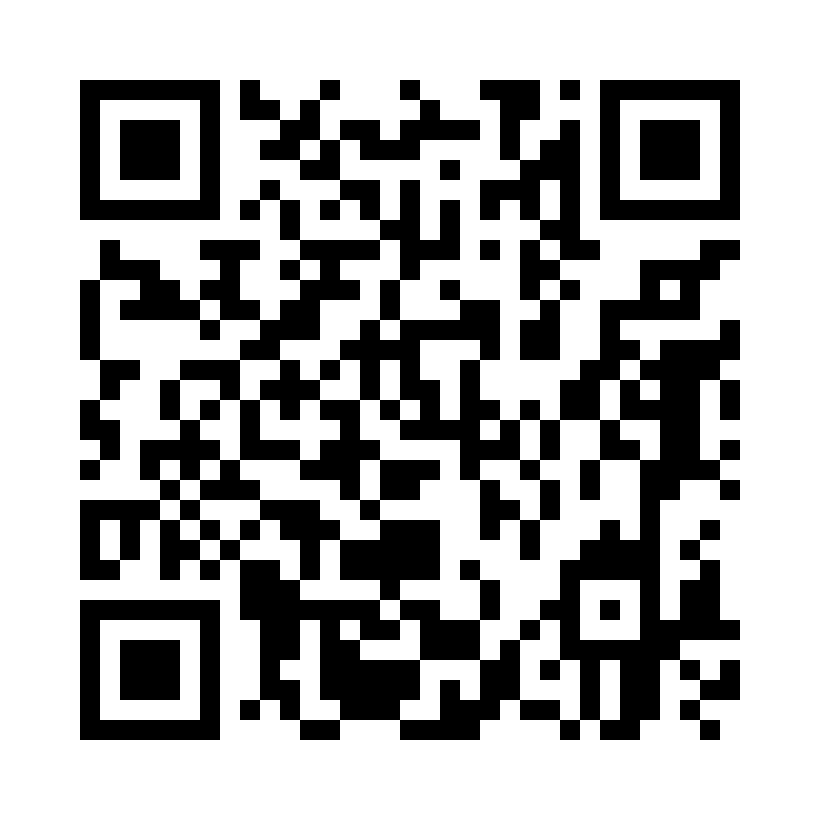
    </td>
    <td align="center">
      <strong>Alipay</strong> 
      
    </td>
  </tr>
</table>
